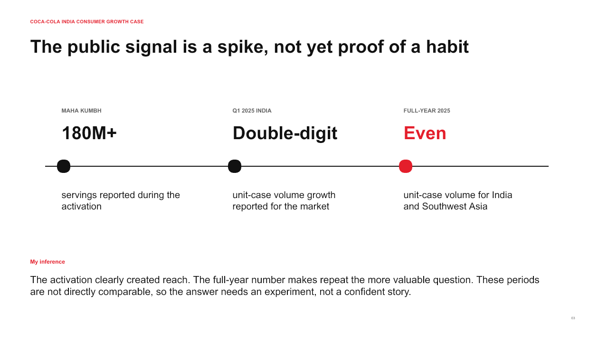

# Coca-Cola India consumer growth case

This public-source case asks how the reach of a major Indian occasion could lead to a second purchase after the event.

> Independent case study based on public reporting and published consumer research.

Coca-Cola reported double-digit India volume growth in Q1 2025 and more than 180 million servings during its Maha Kumbh activation. Its 2025 Form 10-K later reported full-year unit-case volume in India and Southwest Asia as even. The periods are different and cannot be read as a campaign result. They do, however, make repeat purchase a useful problem to test.

## Recommendation

Run a three-cell outlet pilot around one locally relevant consumption occasion:

1. Current assortment and communication.
2. A personalized pack cue linked to the occasion.
3. The same cue with a group-sharing prompt and a reason to return.

The primary measure is incremental transactions per eligible outlet. Thirty-day repeat, gross margin after activation cost, availability and opt-in behavior are the checks around it.

## Files

- [PowerPoint deck](deck/coca-cola-india-occasion-to-habit-case.pptx)
- [PDF deck](deck/coca-cola-india-occasion-to-habit-case.pdf)
- [Case notes](CASE_NOTES.md)
- [Evidence ledger](analysis/evidence-ledger.csv)
- [Sources](sources/SOURCES.md)

The proposal deliberately leaves price, package choice and return forecasts open because public data does not provide outlet economics or a test baseline.
