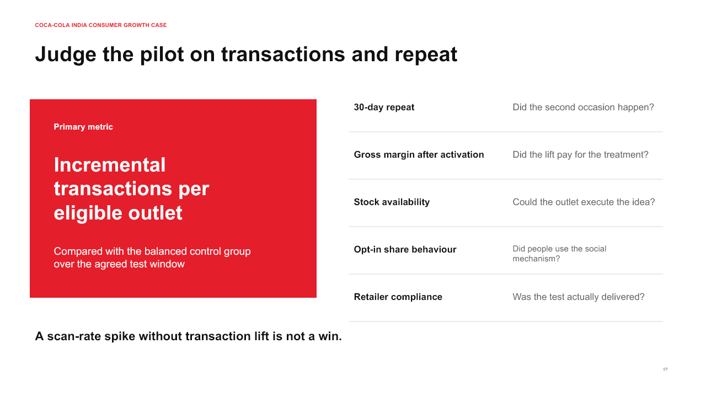

# Coca-Cola India consumer growth case

I used public company reporting and consumer research to answer one question: how could Coca-Cola turn large Indian cultural activations into repeatable consumption occasions, without confusing reach with durable growth?

> **Independent portfolio case study. I did not work for Coca-Cola and I did not use company-confidential data.** Recommendations are hypotheses to test, not claims about Coca-Cola's internal plans.

## The short version

Coca-Cola reported double-digit India volume growth in Q1 2025 after a large Maha Kumbh activation, including more than 180 million servings. For full-year 2025, volume in India and Southwest Asia was even. Those periods are not directly comparable, but together they suggest a useful strategy question: how can high-reach moments create repeat behaviour after the event ends?

My answer is an **occasion-to-habit pilot** that combines a locally relevant moment, a personalized social object, an affordable entry pack chosen through field economics, and a measurable repeat prompt.

## Review the work

- [PowerPoint case deck](deck/coca-cola-india-occasion-to-habit-case.pptx)
- [PDF case deck](deck/coca-cola-india-occasion-to-habit-case.pdf)
- [Written case notes](CASE_NOTES.md)
- [Evidence ledger](analysis/evidence-ledger.csv)
- [Source list](sources/SOURCES.md)

## What I would test

Three outlet groups over a fixed pilot window:

1. Business as usual.
2. Personalized pack cue tied to a local occasion.
3. The same cue plus a group-sharing prompt and a repeat mechanism.

The decision metric is incremental transactions per eligible outlet. Repeat within 30 days, gross margin after activation cost, stock availability and opt-in share behaviour are guardrails.

## Why this is a strategy case, not a campaign review

The case separates verified facts, research evidence and my interpretation. It moves from a market signal to a mechanism, then into an experiment with stop rules. I have deliberately not invented a market size, a price point or a return forecast where public data is not enough.

## Sources

The main sources are Coca-Cola's 2025 Form 10-K, 2025 earnings releases, the official Share a Coke campaign page and peer-reviewed work on personalization, psychological ownership and self-reference. Full URLs and claim notes are in [SOURCES.md](sources/SOURCES.md).
